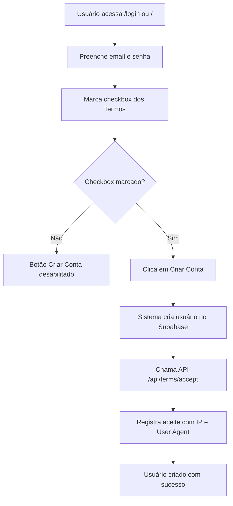
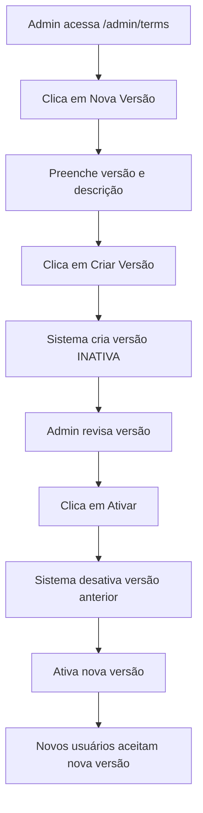

# Sistema de Aceite de Termos - Documentação Completa

## 📋 Visão Geral

Sistema completo de gerenciamento de Termos de Uso com:
- ✅ **Aceite obrigatório** no cadastro (login page e landing page)
- ✅ **Versionamento** de termos
- ✅ **Log de aceites** com IP e User Agent
- ✅ **Interface administrativa** para gerenciar versões
- ✅ **Auditoria completa** de quem aceitou e quando

---

## 🗄️ Estrutura do Banco de Dados

### Tabela: `terms_versions`
Armazena as diferentes versões dos Termos de Uso.

```sql
CREATE TABLE terms_versions (
  id UUID PRIMARY KEY DEFAULT gen_random_uuid(),
  version VARCHAR(50) NOT NULL UNIQUE,
  content TEXT NOT NULL,
  effective_date TIMESTAMP WITH TIME ZONE NOT NULL DEFAULT NOW(),
  created_at TIMESTAMP WITH TIME ZONE DEFAULT NOW(),
  is_active BOOLEAN DEFAULT true
);
```

**Campos**:
- `id`: ID único da versão
- `version`: Nome da versão (ex: "v1.0.0", "v1.1.0")
- `content`: Descrição das mudanças nesta versão
- `effective_date`: Data em que a versão entrou em vigor
- `is_active`: Se esta é a versão ativa (apenas uma pode estar ativa)

### Tabela: `terms_acceptances`
Registra todos os aceites de termos pelos usuários.

```sql
CREATE TABLE terms_acceptances (
  id UUID PRIMARY KEY DEFAULT gen_random_uuid(),
  user_id UUID NOT NULL REFERENCES auth.users(id) ON DELETE CASCADE,
  terms_version_id UUID NOT NULL REFERENCES terms_versions(id) ON DELETE RESTRICT,
  accepted_at TIMESTAMP WITH TIME ZONE DEFAULT NOW(),
  ip_address INET,
  user_agent TEXT,
  UNIQUE (user_id, terms_version_id)
);
```

**Campos**:
- `id`: ID único do registro de aceite
- `user_id`: ID do usuário que aceitou
- `terms_version_id`: ID da versão aceita
- `accepted_at`: Data e hora do aceite
- `ip_address`: Endereço IP do usuário
- `user_agent`: User agent do navegador

**Constraint**: Um usuário só pode aceitar cada versão uma vez (`UNIQUE (user_id, terms_version_id)`)

---

## 🔐 Políticas RLS (Row Level Security)

### `terms_versions`
```sql
-- Qualquer usuário autenticado pode ler versões ativas
CREATE POLICY "Anyone can read active terms versions"
ON terms_versions FOR SELECT
USING (is_active = true);

-- Apenas admins podem gerenciar versões
CREATE POLICY "Only admins can manage terms versions"
ON terms_versions FOR ALL
USING (
  EXISTS (
    SELECT 1 FROM profiles
    WHERE profiles.id = auth.uid()
    AND profiles.role = 'admin'
  )
);
```

### `terms_acceptances`
```sql
-- Usuários podem ver seus próprios aceites
CREATE POLICY "Users can view their own acceptances"
ON terms_acceptances FOR SELECT
USING (auth.uid() = user_id);

-- Usuários podem criar seus próprios aceites
CREATE POLICY "Users can create their own acceptances"
ON terms_acceptances FOR INSERT
WITH CHECK (auth.uid() = user_id);

-- Admins podem ver todos os aceites
CREATE POLICY "Admins can view all acceptances"
ON terms_acceptances FOR SELECT
USING (
  EXISTS (
    SELECT 1 FROM profiles
    WHERE profiles.id = auth.uid()
    AND profiles.role = 'admin'
  )
);
```

---

## 🔧 Funções SQL

### `get_active_terms_version()`
Retorna a versão ativa atual dos termos.

```sql
CREATE OR REPLACE FUNCTION get_active_terms_version()
RETURNS TABLE (
  id UUID,
  version VARCHAR(50),
  content TEXT,
  effective_date TIMESTAMP WITH TIME ZONE
) AS $$
BEGIN
  RETURN QUERY
  SELECT tv.id, tv.version, tv.content, tv.effective_date
  FROM terms_versions tv
  WHERE tv.is_active = true
  ORDER BY tv.effective_date DESC
  LIMIT 1;
END;
$$ LANGUAGE plpgsql SECURITY DEFINER;
```

### `user_has_accepted_current_terms(user_id UUID)`
Verifica se um usuário aceitou a versão atual dos termos.

```sql
CREATE OR REPLACE FUNCTION user_has_accepted_current_terms(p_user_id UUID)
RETURNS BOOLEAN AS $$
DECLARE
  v_current_terms_id UUID;
  v_has_accepted BOOLEAN;
BEGIN
  -- Obter ID da versão ativa atual
  SELECT id INTO v_current_terms_id
  FROM terms_versions
  WHERE is_active = true
  ORDER BY effective_date DESC
  LIMIT 1;

  -- Verificar se usuário aceitou esta versão
  SELECT EXISTS (
    SELECT 1
    FROM terms_acceptances
    WHERE user_id = p_user_id
    AND terms_version_id = v_current_terms_id
  ) INTO v_has_accepted;

  RETURN COALESCE(v_has_accepted, false);
END;
$$ LANGUAGE plpgsql SECURITY DEFINER;
```

---

## 🎯 Fluxo de Uso

### 1. Cadastro de Novo Usuário



### 2. Verificação de Aceite

```typescript
// Verificar se usuário aceitou termos atuais
const { data: hasAccepted } = await supabase
  .rpc('user_has_accepted_current_terms', { p_user_id: userId })

if (!hasAccepted) {
  // Redirecionar para aceitar termos
  router.push('/terms?require_acceptance=true')
}
```

### 3. Criação de Nova Versão (Admin)



---

## 📡 APIs Criadas

### `POST /api/terms/accept`
Registra o aceite dos termos pelo usuário.

**Request**: Nenhum body necessário (usa usuário autenticado)

**Response**:
```json
{
  "success": true,
  "message": "Aceite registrado com sucesso",
  "data": {
    "version": "v1.0.0",
    "accepted_at": "2025-01-23T10:30:00Z"
  }
}
```

### `GET /api/terms/accept`
Verifica se o usuário aceitou a versão atual.

**Response**:
```json
{
  "success": true,
  "has_accepted": true,
  "current_version": "v1.0.0"
}
```

### `POST /api/admin/terms/versions`
Cria uma nova versão dos termos (apenas admin).

**Request**:
```json
{
  "version": "v1.1.0",
  "content": "Adicionada seção sobre proteção de dados..."
}
```

**Response**:
```json
{
  "success": true,
  "message": "Versão criada com sucesso",
  "data": {
    "id": "uuid",
    "version": "v1.1.0",
    "is_active": false
  }
}
```

### `POST /api/admin/terms/versions/[id]/activate`
Ativa uma versão específica dos termos (apenas admin).

**Response**:
```json
{
  "success": true,
  "message": "Versão ativada com sucesso"
}
```

---

## 🎨 Componentes Frontend

### 1. Página de Login (`/login`)
- **Checkbox obrigatório**: Usuário deve marcar para criar conta
- **Link para termos**: Abre `/terms` em nova aba
- **Validação**: Botão "Criar Conta" desabilitado se não aceito
- **Registro automático**: Após criar conta, registra aceite automaticamente

### 2. Landing Page (`/`)
- **Checkbox obrigatório**: Mesma validação da página de login
- **Design moderno**: Interface profissional na página inicial
- **Link para termos**: Abre `/terms` em nova aba
- **Validação**: Botão "Criar Conta" desabilitado se não aceito

### 3. Página de Termos (`/terms`)
- **Design profissional**: 9 seções legais
- **Botões de navegação**: Topo e rodapé para retornar ao dashboard
- **Versão dinâmica**: Data atualizada automaticamente
- **Responsivo**: Mobile e desktop

### 4. Painel Admin (`/admin/terms`)
- **Gerenciar versões**: Criar, visualizar, ativar
- **Estatísticas**: Total de versões e aceites
- **Tabela de versões**: Status, aceites, data
- **Controle de ativação**: Apenas uma versão ativa por vez

---

## 📊 Dados Rastreados no Aceite

Quando um usuário aceita os termos, o sistema registra:

1. **user_id**: Quem aceitou
2. **terms_version_id**: Qual versão foi aceita
3. **accepted_at**: Quando aceitou (timestamp preciso)
4. **ip_address**: De onde aceitou (IPv4/IPv6)
5. **user_agent**: Com qual navegador

### Exemplo de Registro:
```json
{
  "id": "550e8400-e29b-41d4-a716-446655440000",
  "user_id": "123e4567-e89b-12d3-a456-426614174000",
  "terms_version_id": "789e0123-e89b-12d3-a456-426614174000",
  "accepted_at": "2025-01-23T14:30:00.123456Z",
  "ip_address": "192.168.1.100",
  "user_agent": "Mozilla/5.0 (Windows NT 10.0; Win64; x64)..."
}
```

---

## 🔒 Proteção Legal

### O Que o Sistema Garante:

✅ **Consentimento Explícito**: Checkbox obrigatório antes do cadastro
✅ **Prova de Aceite**: Registro permanente com timestamp
✅ **Rastreabilidade**: IP e User Agent salvos
✅ **Versionamento**: Histórico completo de mudanças
✅ **Auditoria**: Admins podem ver quem aceitou o quê
✅ **Conformidade LGPD**: Transparência total

### Casos de Uso Legal:

1. **Disputa Legal**: Provar que usuário aceitou termos específicos
2. **Auditoria**: Demonstrar compliance com regulações
3. **Investigação**: Rastrear aceites suspeitos por IP
4. **Migração**: Identificar usuários que precisam aceitar nova versão

---

## 🚀 Como Usar

### Administrador

1. **Acessar Painel**:
   - Login como admin
   - Menu lateral > Admin > Termos de Uso

2. **Criar Nova Versão**:
   - Clicar em "Nova Versão"
   - Inserir número da versão (ex: v1.1.0)
   - Descrever mudanças
   - Clicar em "Criar Versão"

3. **Ativar Versão**:
   - Na tabela, encontrar versão desejada
   - Clicar em "Ativar"
   - Confirmar ativação
   - Versão anterior será desativada automaticamente

4. **Monitorar Aceites**:
   - Ver coluna "Aceites" na tabela
   - Número mostra quantos usuários aceitaram cada versão

### Usuário Final

1. **Cadastro via Landing Page**:
   - Acessar `/`
   - Preencher dados no formulário
   - **Marcar checkbox** "Li e aceito os Termos de Uso"
   - Clicar em "Criar Conta"

2. **Cadastro via Login**:
   - Acessar `/login`
   - Preencher dados
   - **Marcar checkbox** "Li e aceito os Termos de Uso"
   - Clicar em "Criar Conta"

3. **Ler Termos**:
   - Clicar no link azul "Termos de Uso"
   - Abre em nova aba
   - Ler todo o documento
   - Voltar para concluir cadastro

---

## 📁 Arquivos Criados/Modificados

### Migrations
- `supabase/migrations/20250123_create_terms_acceptance.sql`

### Types
- `src/types/index.ts` (adicionado `TermsVersion` e `TermsAcceptance`)

### APIs
- `src/app/api/terms/accept/route.ts`
- `src/app/api/admin/terms/versions/route.ts`
- `src/app/api/admin/terms/versions/[id]/activate/route.ts`

### Pages
- `src/app/admin/terms/page.tsx`
- `src/app/terms/page.tsx` (modificado - adicionados botões de navegação)
- `src/app/login/page.tsx` (modificado - adicionado checkbox)
- `src/app/page.tsx` (modificado - adicionado checkbox na landing page)

### Components
- `src/components/admin/TermsManager.tsx`
- `src/components/dashboard/Sidebar.tsx` (modificado - adicionado link)

---

## ✅ Checklist de Implementação

- [x] Criar tabelas no banco (`terms_versions`, `terms_acceptances`)
- [x] Criar políticas RLS
- [x] Criar funções SQL helper
- [x] Adicionar tipos TypeScript
- [x] Criar API de aceite de termos
- [x] Criar API de gerenciamento de versões
- [x] Adicionar checkbox obrigatório na página de login
- [x] Adicionar checkbox obrigatório na landing page
- [x] Registrar aceite automaticamente após cadastro
- [x] Criar painel administrativo de gerenciamento
- [x] Adicionar link no menu admin
- [x] Rastrear IP e User Agent
- [x] Sistema de versionamento completo
- [x] Interface de ativação de versões
- [x] Estatísticas de aceites por versão
- [x] Adicionar botões de navegação na página de termos

---

## 🎯 Próximos Passos Recomendados

1. **Modal de Aceite**: Forçar usuários existentes a aceitar nova versão
2. **Email de Notificação**: Avisar por email quando termos mudarem
3. **Histórico Detalhado**: Página para ver todos os aceites de um usuário
4. **Exportação**: Exportar logs de aceites em CSV/PDF
5. **Diff de Versões**: Mostrar diferenças entre versões
6. **Aprovação Legal**: Workflow de aprovação antes de ativar versão

---

## 🔍 Exemplos de Queries Úteis

### Ver todos os aceites de um usuário
```sql
SELECT
  ta.accepted_at,
  tv.version,
  ta.ip_address,
  ta.user_agent
FROM terms_acceptances ta
JOIN terms_versions tv ON ta.terms_version_id = tv.id
WHERE ta.user_id = 'user-id-here'
ORDER BY ta.accepted_at DESC;
```

### Ver usuários que ainda não aceitaram versão atual
```sql
WITH current_version AS (
  SELECT id FROM terms_versions WHERE is_active = true LIMIT 1
)
SELECT p.id, p.email
FROM profiles p
LEFT JOIN terms_acceptances ta
  ON p.id = ta.user_id
  AND ta.terms_version_id = (SELECT id FROM current_version)
WHERE ta.id IS NULL;
```

### Estatísticas de aceites por versão
```sql
SELECT
  tv.version,
  COUNT(ta.id) as total_acceptances,
  tv.is_active
FROM terms_versions tv
LEFT JOIN terms_acceptances ta ON tv.id = ta.terms_version_id
GROUP BY tv.id, tv.version, tv.is_active
ORDER BY tv.created_at DESC;
```

---

## 🐛 Problemas Resolvidos

### Erro: `.group()` não suportado no Supabase
**Problema**: A função `.group()` não existe no Supabase client-side.

**Solução**: Calcular estatísticas manualmente usando JavaScript:
```typescript
// Buscar todos os aceites
const { data: allAcceptances } = await supabase
  .from('terms_acceptances')
  .select('terms_version_id')

// Calcular estatísticas manualmente
const acceptanceStats = versions?.map(version => {
  const count = allAcceptances?.filter(a => a.terms_version_id === version.id).length || 0
  return {
    terms_version_id: version.id,
    count
  }
}) || []
```

---

**Implementação completa! 🎉**

Sistema de aceite de termos totalmente funcional com versionamento, auditoria e proteção legal.
